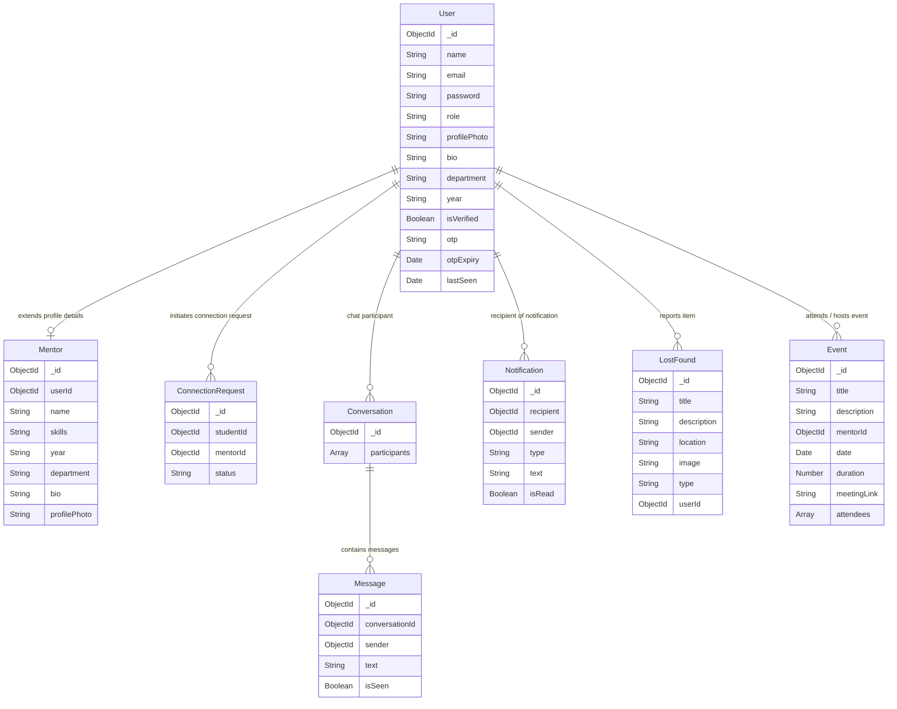

# Aspira - Student Mentorship & Collaboration Hub

Aspira is a production-ready, full-stack MERN platform designed to connect campus students with experienced senior mentors, providing real-time websocket chats, visual notifications, a lost & found board, and advanced AI services.

---

## Technical Stack

*   **Frontend**: React (Vite), React Router DOM, Axios, Tailwind CSS, Lucide icons, React Toastify, SweetAlert2.
*   **Backend**: Node.js, Express.js, Socket.IO, JWT, bcryptjs, Multer, Cloudinary, Nodemailer.
*   **Database**: MongoDB Atlas via Mongoose ODM.
*   **AI Integration**: Natural Language Text PDF parser, Hugging Face BART API.
*   **Video Call**: Peer-to-peer WebRTC streams, Socket.IO signaling.

---

## Folder Structure

```
aspira/
├── backend/
│   ├── config/          # db, cloudinary, nodemailer configurations
│   ├── controllers/     # auth, connection, chat, lostfound, ai, events, profile controllers
│   ├── middlewares/     # auth validation, multer upload, rate-limit middlewares
│   ├── models/          # user, mentor, connectionRequest, conversation, message, notification, lostfound, event schemas
│   ├── routes/          # express endpoints routing maps
│   ├── socket/          # socket handler relays (online status, message sync, WebRTC relays)
│   ├── utils/           # OTP generators, AI parsing algorithms
│   ├── server.js        # Express + HTTP Socket server binding
│   └── package.json
└── frontend/
    ├── public/
    ├── src/
    │   ├── components/  # navbar, sidebar, cards, loading spinners
    │   ├── context/     # auth, socket, notification providers
    │   ├── pages/       # landing, login, register, dashboard, directory, chat, lostfound, resume, chatbot, events, profile
    │   ├── services/    # api client configured with request interceptors
    │   ├── index.css    # tailwind directive maps + custom glassmorphism styles
    │   └── App.jsx      # react router entrypoint
    ├── tailwind.config.js
    ├── vite.config.js
    └── vercel.json
```

---

## Database Design Diagram



---

## Environmental Setup

Create a `.env` file under the `/backend` directory based on the `.env.example` template:

```env
PORT=5000
MONGO_URI=your_mongodb_connection_uri
JWT_SECRET=your_jwt_signature_secret
CLIENT_URL=http://localhost:5173

# Nodemailer credentials (falls back to console prints in dev mode)
EMAIL_USER=your_smtp_email@gmail.com
EMAIL_PASS=your_smtp_app_password

# Cloudinary credentials (falls back to local uploads folder in dev mode)
CLOUDINARY_NAME=your_cloudinary_cloud_name
CLOUDINARY_KEY=your_cloudinary_api_key
CLOUDINARY_SECRET=your_cloudinary_api_secret

# Hugging Face AI (falls back to rule-based keyword extraction in dev mode)
HUGGING_FACE_TOKEN=your_hugging_face_read_token
```

---

## Local Development Execution

1.  **Clone / Copy directory**:
    Open the directory in your code editor.

2.  **Run Backend Server**:
    ```bash
    cd backend
    npm install
    npm run dev
    ```

3.  **Run Frontend Server**:
    ```bash
    cd ../frontend
    npm install
    npm run dev
    ```

4.  **Access Web Dashboard**:
    Open browser pointing to `http://localhost:5173`.
